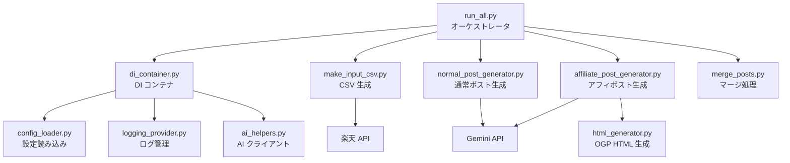
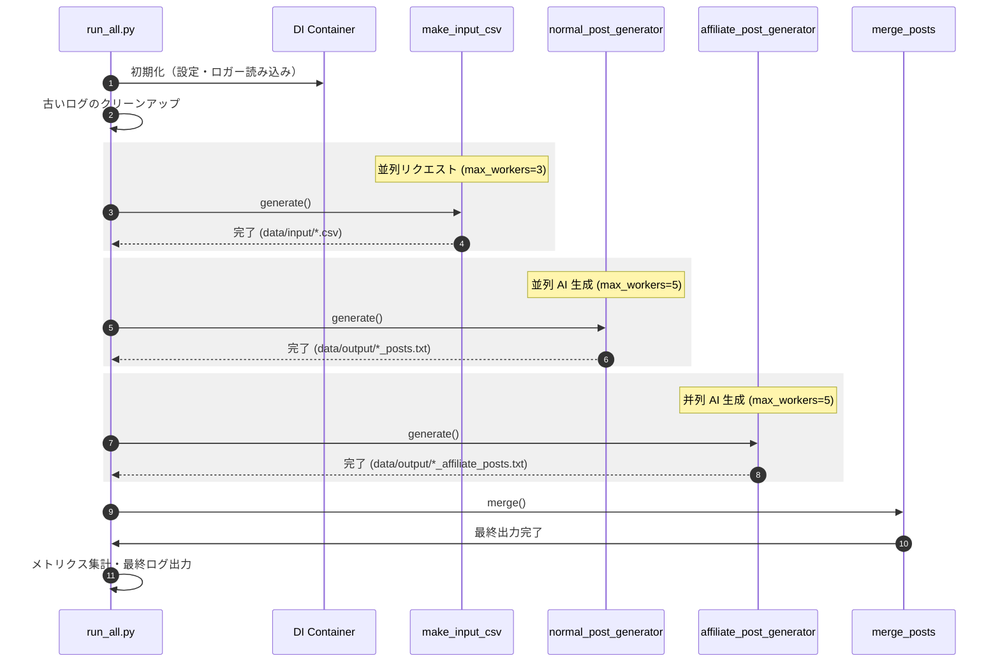

# システム詳細設計書 - rktn パイプライン最適化版

## 1. システム概要

本システムは、楽天 API から商品情報を取得し、Gemini AI を活用して X（旧Twitter）向けの投稿文を自動生成・マージする自動投稿支援パイプラインです。
最適化により、I/O 待ちの並列化とプロセス起動オーバーヘッドの削減を実現しています。

## 2. アーキテクチャ構成

### 2.1 コンポーネント関連図

### 2.2 主要コンポーネントの役割

| コンポーネント                | 役割                                                     | 最適化のポイント                                      |
| :---------------------------- | :------------------------------------------------------- | :---------------------------------------------------- |
| `run_all.py`                  | 全体の実行順序制御、メトリクス集計、ログ整理。           | サブプロセスを廃止し、モジュール直接実行へ変更。      |
| `di_container.py`             | 設定、AIクライアント、ロガーのシングルトン管理と注入。   | 共有インスタンス化によりリソース効率を向上。          |
| `make_input_csv.py`           | 楽天APIから情報を取得し、`data/input` に保存。           | `ThreadPoolExecutor` (max_workers=3) による並列取得。 |
| `normal_post_generator.py`    | テーマに基づきAIで投稿文を作成。                         | `ThreadPoolExecutor` (max_workers=5) による並列生成。 |
| `affiliate_post_generator.py` | 商品情報とOGPリンクを含むアフィポストを生成。            | `ThreadPoolExecutor` (max_workers=5) による並列生成。 |
| `html_generator.py`           | 商品画像・タイトル・リダイレクト先を含む静的HTMLを生成。 | -                                                     |

## 3. 処理フロー

### 3.1 全体処理シーケンス

## 4. 並列処理の設計方針

### 4.1 通信レート制限への配慮

並列化にあたり、外部 API のレート制限（Rate Limit）を遵守するための設計を行っています。

- **楽天 API (make_input_csv)**:
  - ワーカ数を `3` に制限。
  - 各スレッドの開始時に `time.sleep(0.5)` を挿入し、リクエストの密度を制御。
- **Gemini API (AI 生成系)**:
  - ワーカ数を `5` に制限。
  - `ai_helpers.py` 内の指数バックオフ付きリトライ機構により、`429 Resource Exhausted` エラー発生時も安全に再試行。

## 5. データ構造

- **入力データ**: `config/accounts.yaml`, `config/themes.yaml`
- **中間データ**: `data/input/{account}_input.csv` (タイトル, URL, 画像URL)
- **出力データ**: `data/output/{account}_posts.txt` (マージ済みの投稿文リスト)
