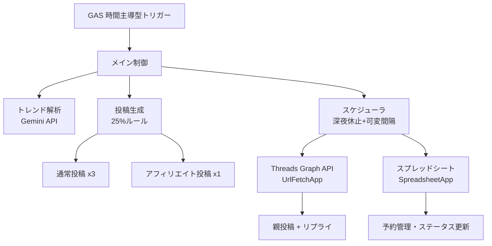

# GAS版 Threads×楽天アフィリエイト 全自動運用システム 実装計画

## 概要

**Google Apps Script (GAS)** のみで完結する、Threads×楽天アフィリエイト全自動運用システムを構築します。GAS の時間主導型トリガーにより、深夜休止・可変間隔のスケジューリングを実現し、外部ライブラリは一切不要です。

## アーキテクチャ概要



## GAS ファイル構成

すべてのコードは **1つの GAS プロジェクト** 内に以下の `.gs` ファイルとして配置します：

| ファイル名         | 役割                                      |
| ------------------ | ----------------------------------------- |
| `Config.gs`        | 定数・APIキー・スケジューリング設定       |
| `TrendAnalyzer.gs` | Gemini API によるトレンド解析             |
| `PostGenerator.gs` | 25%ルールに基づく4件セット生成            |
| `Scheduler.gs`     | 深夜休止・可変間隔のスケジュール計算      |
| `ThreadsAPI.gs`    | Threads Graph API 投稿（UrlFetchApp）     |
| `SheetsManager.gs` | SpreadsheetApp による予約・ステータス管理 |
| `Main.gs`          | エントリポイント・トリガー関数            |

---

## 各ファイルの実装詳細

### Config.gs

スクリプトプロパティから API キーを取得する設計（ハードコードしない）。

```javascript
// スクリプトプロパティに格納すべきキー:
// GEMINI_API_KEY, THREADS_ACCESS_TOKEN, THREADS_USER_ID,
// RAKUTEN_APP_ID, RAKUTEN_AFFILIATE_ID
```

**スケジューリング定数:**

- 休止: 0:00〜6:59
- ゴールデンタイム (20:00〜23:00): 45〜60分間隔
- 通常時間: 90〜120分間隔

---

### TrendAnalyzer.gs

- Gemini API（`UrlFetchApp.fetch`）へプロンプトを送信
- ターゲット: 30代・事務職・ライフハック界隈
- 結果を JSON パースして `{keywords, themes, tone_style, seasonal_topics}` として返却
- トレンド結果を `PropertiesService` にキャッシュ（6時間有効）

---

### PostGenerator.gs

- **通常投稿 (1〜3件目)**: トレンド文脈 + Threads風プロンプト
  - 改行多用・問いかけ形式
  - 500文字以内
- **アフィリエイト投稿 (4件目)**: 楽天商品 + トレンド連動
  - 140〜500文字、`#PR` 必須
  - 楽天 API で商品情報取得 → AI で文案生成

---

### Scheduler.gs

- `getNextPostTime()` — 次の投稿可能時刻を算出
- `shouldPostNow()` — 現在時刻が投稿すべきタイミングか判定
- `isGoldenTime(hour)` — ゴールデンタイム判定
- `isQuietHours(hour)` — 休止時間判定

---

### ThreadsAPI.gs

- `createMediaContainer(text)` — `POST /{user-id}/threads`
- `publishContainer(containerId)` — `POST /{user-id}/threads_publish`
- `publishPost(text)` — テキスト投稿（コンテナ作成→公開）
- `publishReply(parentId, text)` — リプライ投稿

---

### SheetsManager.gs

- `writePendingPosts(postSet, schedule)` — 予約書き込み
- `getNextPendingPost()` — 次の未投稿を取得
- `updatePostStatus(row, status, threadId)` — ステータス更新

**シート列構成:** `[予定時刻, 投稿タイプ, 投稿本文, ステータス, ThreadsID, 作成日時]`

---

### Main.gs

2つのエントリポイント:

1. **`generateAndSchedule()`** — 手動実行 or 日次トリガーで4件セット生成→シート書き込み
2. **`processScheduledPosts()`** — 1分間隔トリガーで未投稿を監視→投稿実行

---

## セットアップ手順

1. Google スプレッドシートを作成
2. 拡張機能 → Apps Script でプロジェクト作成
3. 各 `.gs` ファイルを作成・貼り付け
4. スクリプトプロパティに API キーを設定
5. トリガー設定:
   - `generateAndSchedule`: 日次（午前7時）
   - `processScheduledPosts`: 1分間隔

---

## 検証計画

### 手動テスト

1. `testTrendAnalysis()` — トレンド解析の動作確認
2. `testPostGeneration()` — 4件セット生成の確認
3. `testThreadsPost()` — Threads 投稿テスト（ドライランモード付き）
4. `testScheduler()` — スケジュール計算の確認

> [!NOTE]
> GAS にはテストフレームワークがないため、各モジュールに `test*()` 関数を用意し、スクリプトエディタから手動実行で検証します。ドライランモードでは実際の API 呼び出しをスキップしてログ出力のみ行います。
