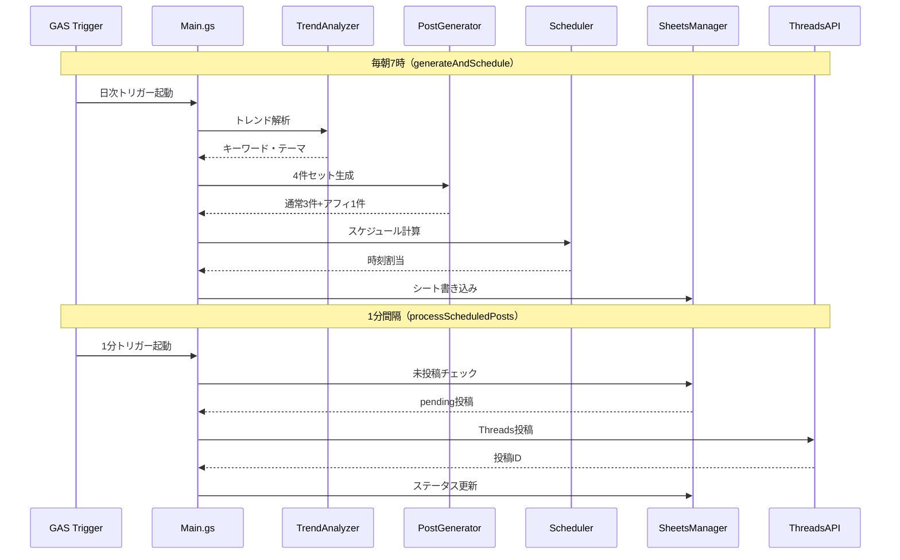

# 実装完了レポート: GAS版 Threads×楽天アフィリエイト全自動運用システム

## 実装内容

Google Apps Script (GAS) のみで完結する、Threads 全自動投稿システムを構築しました。

### 作成ファイル一覧

| ファイル                                                                                           | 行数 | 役割                                       |
| -------------------------------------------------------------------------------------------------- | ---- | ------------------------------------------ |
| [Config.gs](file:///c:/Users/hax37/Documents/yusuke_doc/git/work/rktn/gas/Config.gs)               | ~100 | 設定管理（スクリプトプロパティ、定数）     |
| [TrendAnalyzer.gs](file:///c:/Users/hax37/Documents/yusuke_doc/git/work/rktn/gas/TrendAnalyzer.gs) | ~155 | Gemini API トレンド解析（6時間キャッシュ） |
| [PostGenerator.gs](file:///c:/Users/hax37/Documents/yusuke_doc/git/work/rktn/gas/PostGenerator.gs) | ~250 | 25%ルール 4件セット生成（楽天API連携）     |
| [Scheduler.gs](file:///c:/Users/hax37/Documents/yusuke_doc/git/work/rktn/gas/Scheduler.gs)         | ~160 | 深夜休止・可変間隔スケジューラ             |
| [ThreadsAPI.gs](file:///c:/Users/hax37/Documents/yusuke_doc/git/work/rktn/gas/ThreadsAPI.gs)       | ~175 | Threads Graph API 投稿（UrlFetchApp）      |
| [SheetsManager.gs](file:///c:/Users/hax37/Documents/yusuke_doc/git/work/rktn/gas/SheetsManager.gs) | ~240 | SpreadsheetApp 予約管理・ログ              |
| [Main.gs](file:///c:/Users/hax37/Documents/yusuke_doc/git/work/rktn/gas/Main.gs)                   | ~280 | 統合制御・トリガー・カスタムメニュー       |

### 動作フロー

## テスト方法

1. `Config.gs` の `DRY_RUN` を `true` に変更
2. GAS エディタから `runFullTest()` を実行
3. 実行ログで各モジュールの動作を確認
4. 問題なければ `DRY_RUN` を `false` に戻して本番運用

## 次のステップ

詳細なセットアップ手順は [SETUP_GUIDE.md](file:///c:/Users/hax37/Documents/yusuke_doc/git/work/rktn/gas/SETUP_GUIDE.md) を参照してください。
